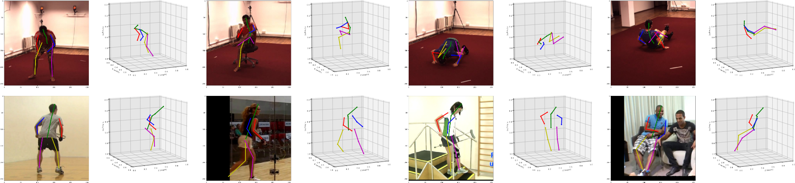
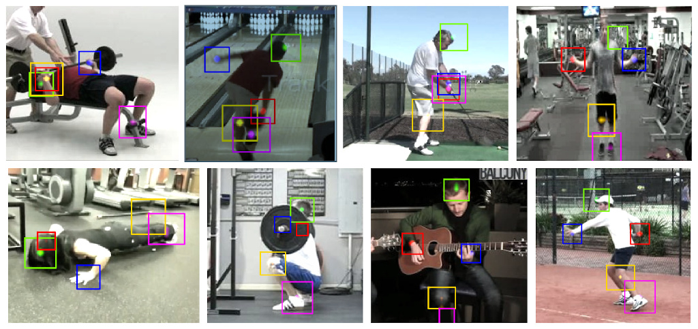

# Deep Human Action Recognition

This software is provided as a supplementary material for our CVPR'18 and TPAMI'20 papers:
> 2D/3D Pose Estimation and Action Recognition using Multitask Deep Learning (CVPR'18) [ [arXiv](https://arxiv.org/pdf/1802.09232.pdf) ]



A demonstration video can be seen [here](https://www.youtube.com/watch?v=MNEZACbFA4Y&t=6s).

> Multi-task Deep Learning for Real-Time 3D Human Pose Estimation and Action Recognition (TPAMI'20) [ [arXiv](https://arxiv.org/pdf/1912.08077.pdf) ]




## Notice

This repo has been updated with our recent code for multi-task human
pose estimation and action recognition, related to our TPAMI'20 [ [paper](https://arxiv.org/pdf/1912.08077.pdf) ]. If you are looking for the source code from our CVPR'18 [ [paper](https://arxiv.org/pdf/1802.09232.pdf) ], please checkout the [cvpr18 branch](https://github.com/dluvizon/deephar/tree/cvpr18).

If you have trouble in using this code and need an _urgent_ help, please send me an e-mail at `<[first name][last name] at gmail dot com>`.


## How to install

Please refer to the [installation guide](INSTALL.md).


## Evaluation on Public Datasets

### 2D pose estimation on MPII (CVPR'18 model)

The model trained on MPII data reached 91.2% on the test set using multi-crop
and horizontal flipping data augmentation, and 89.1% on the validation set,
single-crop.
To reproduce results on validation, do:
```sh
  python3 exp/mpii/eval_mpii_singleperson.py output/eval-mpii
```
The output will be stored in `output/eval-mpii/log.txt`.

### Multi-task model for 2D pose estimation and action recognition

The multitask model can be evaluated on MPII for pose estimation and on PennAction for action recognition by:
```sh
  python3 exp/pennaction/eval_penn_multitask.py output/eval-penn
```
The output will be stored in `output/eval-penn/log.txt`

### 3D pose estimation on Human3.6M (CVPR'18 model)

This model was trained using MPII and Human3.6M data.
Evaluation on Human3.6M is performed on the validation set.
To reproduce our results, do:
```
  python3 exp/h36m/eval_h36m.py output/eval-h36m
```
The mean per joint position error is 55.1 mm on single crop.
Note that some scores on individual activities differ from reported results
on the paper. That is because for the paper we computed scores using one frame
every 60, instead of using one frame every 64. The average score is the same.

### Multi-task model for 3D pose estimation and action recognition

This model was trained simultaneously on MPII (2D pose), Human3.6 (3D pose) and NTU (action), and the results can be replicated on NTU for action recognition by:
```
  python3 exp/ntu/eval_ntu_multitask.py output/eval-ntu
```
The output will be stored in `output/eval-ntu/log.txt`

## Citing

Please cite our papers if this software (including any part of it) or the provided weights are
useful for you.
```
@ARTICLE{Luvizon_2020_TPAMI,
  author={D. {Luvizon} and D. {Picard} and H. {Tabia}},
  journal={IEEE Transactions on Pattern Analysis and Machine Intelligence}, 
  title={Multi-task Deep Learning for Real-Time 3D Human Pose Estimation and Action Recognition}, 
  year={2020},
  volume={},
  number={},
  pages={1-1},
}

@InProceedings{Luvizon_2018_CVPR,
  author = {Luvizon, Diogo C. and Picard, David and Tabia, Hedi},
  title = {2D/3D Pose Estimation and Action Recognition Using Multitask Deep Learning},
  booktitle = {The IEEE Conference on Computer Vision and Pattern Recognition (CVPR)},
  month = {June},
  year = {2018}
}
```

## License

MIT License

  
